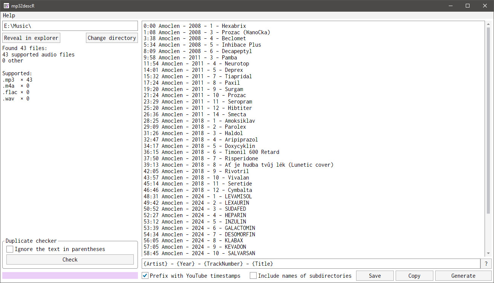

#  mp32descR

Creates text summaries for collections of your mp3 (or other audio) files.

## Screenshot



## Why?

When I upload albums/custom mixes to YouTube, I use this program to automatically generate descriptions with proper timestamps, so YouTube will correctly segment the video timeline. Sometimes, I use it to take notes about tracks in an "unknown" playlist I'm currently listening to. It could also be used to share information about your offline playlists with others, but there might be better ways to do it. This program is probably pretty niche, but it's definitely useful to _someone_.

## Dependencies

* .NET 10
* [Avalonia](https://github.com/AvaloniaUI/Avalonia) ([MIT](https://github.com/AvaloniaUI/Avalonia/blob/main/licence.md))
* [Zeugma440/atldotnet](https://github.com/Zeugma440/atldotnet) ([MIT](https://github.com/Zeugma440/atldotnet/blob/main/LICENSE))
* [Inconsolata](https://levien.com/type/myfonts/inconsolata.html) ([SIL Open Font License](https://github.com/google/fonts/blob/main/ofl/inconsolata/OFL.txt))

## Changelog

### 1.0

* Remade the original [mp32desc](https://github.com/RDMCz/mp32desc) in Avalonia
* Added the _Duplicate checker_ feature: It detects imported audio files that do not have a unique title with an option to ignore text in parentheses (like _feat._, _remix_, _live_ etc.)

## Building locally

Prerequisite: [.NET 10 SDK](https://dotnet.microsoft.com/en-us/download/dotnet/10.0)

### Build & run on Linux

```bash
make
cd PUBLISHED/
./mp32descR
```

### Build & run on Windows

```powershell
.\makew.ps1
cd .\PUBLISHED\
.\mp32descR.exe
```
